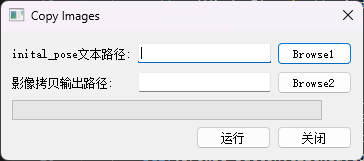

# CopyImagesProgram
该程序用于从指定的文本文件中读取图像路径，并将这些图像复制到指定的输出目录。程序提供了一个图形用户界面（GUI），用户可以通过该界面选择输入文件和输出目录，并查看复制进度。


## 功能特性

- 从文本文件中读取图像路径
- 将图像复制到指定的输出目录
- 提供图形用户界面，便于用户操作
- 显示复制进度

## 安装

1. 克隆此仓库到本地：

   ```bash
   git clone https://github.com/Henrik-JIA/CopyImagesProgram.git
   ```

2. 进入项目目录：

   ```bash
   cd CopyImagesProgram
   ```

3. 安装所需的依赖：

   ```bash
   pip install -r requirements.txt
   ```

## 项目结构

``` 
CopyImagesProgram/
│
├── output/         # 输出目录
│
├── txt/          # 存放文本文件inital_pose.txt
│
├── copy_images.py     # 图像复制逻辑
├── main_interface.py    # GUI 主界面
```

## 使用方法

1. 启动程序：

   ```bash
   python main_interface.py
   ```

2. 在GUI中，选择包含图像路径的输入文件。

3. 选择图像要复制到的输出目录。

4. 点击“开始复制”按钮，查看复制进度。

## 许可证

该项目使用 MIT 许可证。详情请参阅 [LICENSE](LICENSE) 文件。